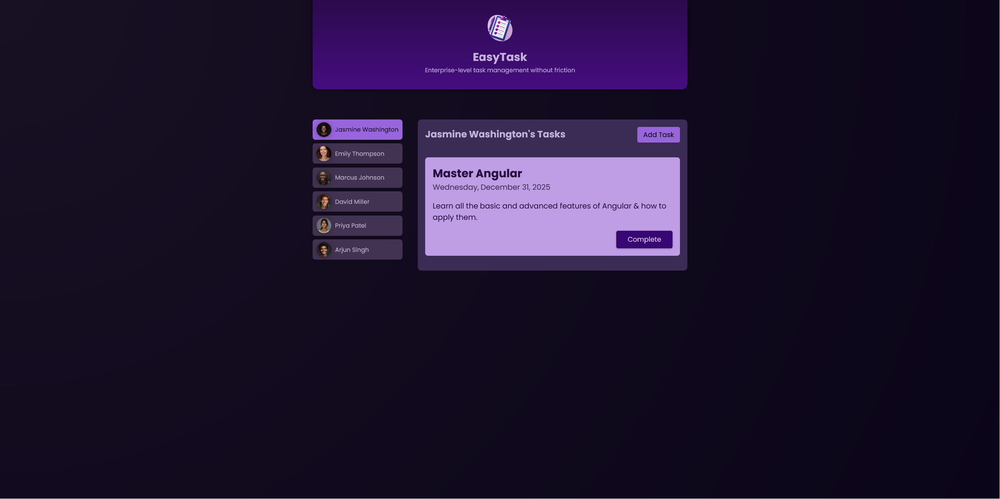

# Angular Udemy course first demo project
This is the first project from the [Udemy course on Angular by Maximilian Schwarzmüller](https://www.udemy.com/course/the-complete-guide-to-angular-2)

## Table of contents

- [Overview](#overview)
  - [Intro](#Intro)
  - [Screenshot](#screenshot)
  - [Links](#links)
- [My process](#my-process)
  - [Built with](#built-with)
- [Author](#author)

## Overview

## Intro

This is a simple Task management application, where you can select users from a list and create, complete and see tasks made on angular as part of the udemy course.
Made with only HTML, css, Typescript and Angular, data saves on the local storage of the browser.

### Screenshot

### Links

- Solution URL: [netlify](https://ac-easy-task.netlify.app/)

## My process

### Built with

- Semantic HTML5 markup
- CSS custom properties
- [Angular](https://angular.dev/) - JS library

## Author

- Linkedin - [Arturo Guzmán Lucena](https://www.linkedin.com/in/agl-ab5aa228a/)
